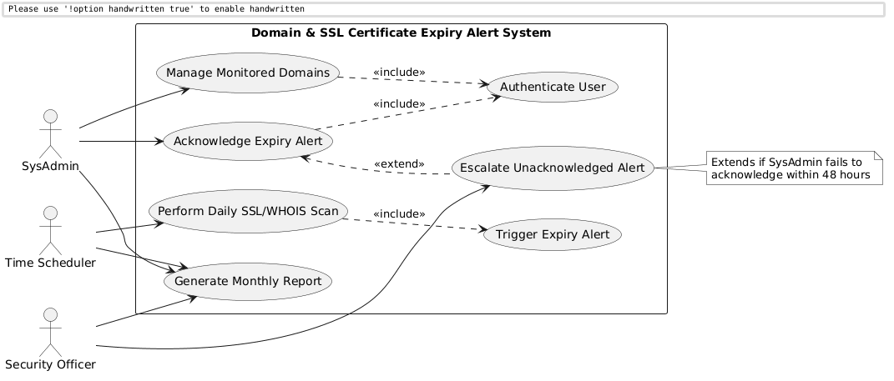

# Lab 1: Requirements Engineering & UML Use-Case Modelling

**Institution:** PES University — Department of Computer Science & Engineering  
**Course Title:** Requirements Engineering & Object-Oriented Software Design Lab  
**Problem Statement #47:** Domain & SSL Certificate Expiry Alert System  
**Domain:** Developer Tools & IT Operations  

### Student Details
- **Student Name:** Sujay Hegde
- **GitHub:** [sujayhegde23](https://github.com/sujayhegde23)
- **Repository:** [LAB-1_Activity](https://github.com/sujayhegde23/LAB-1_Activity)

---

## 📖 1. Problem Context & Overview

An IT operations utility that performs automated daily WHOIS registration and SSL/TLS handshake audits, alerting sysadmins through escalation ladders before domain or certificate expiration.

### Target Stakeholders & Actors:
- **`SysAdmin`**: Primary administrator who configures monitored domains and acknowledges impending expiry alerts.
- **`Security Officer`**: Secondary actor who receives escalated alerts if a SysAdmin fails to take action in time.

---

## 📋 2. Deliverables

The lab deliverables are separated into clean, easy-to-read markdown files.

1. **[Requirements Table](Requirements.md)**
   - Contains 5 Functional Requirements (FR) covering scanning, alerts, and escalation.
   - Contains 2 Non-Functional Requirements (NFR) covering performance and reliability.
2. **[UML Use-Case Diagram](UseCaseDiagram.md)**
   - PlantUML source code mapping all actors and relationships (`<<include>>`, `<<extend>>`).
3. **[Use-Case Flow Specification](UseCaseSpecification.md)**
   - A detailed 1-page spec for **UC-005: Acknowledge Expiry Alert**.

---

## 📊 3. UML Use-Case Diagram

