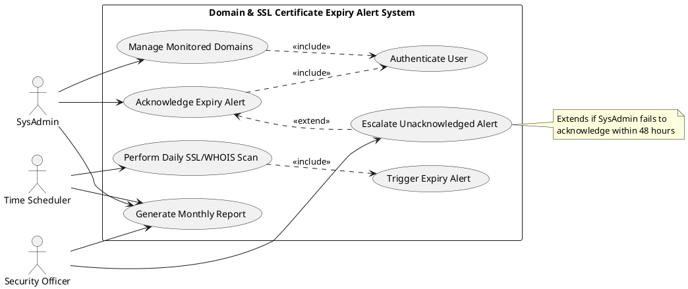

# UML Use-Case Diagram

The following diagram models all actors, primary use cases, and includes `<<include>>` and `<<extend>>` relationships as specified.

```plantuml
@startuml
left to right direction
skinparam packageStyle rectangle

actor "SysAdmin" as SA
actor "Security Officer" as SO
actor "Time Scheduler" as Timer

rectangle "Domain & SSL Certificate Expiry Alert System" {
  usecase "Manage Monitored Domains" as UC1
  usecase "Authenticate User" as UC2
  usecase "Perform Daily SSL/WHOIS Scan" as UC3
  usecase "Trigger Expiry Alert" as UC4
  usecase "Acknowledge Expiry Alert" as UC5
  usecase "Escalate Unacknowledged Alert" as UC6
  usecase "Generate Monthly Report" as UC7
}

SA --> UC1
SA --> UC5
SA --> UC7

SO --> UC6
SO --> UC7

Timer --> UC3
Timer --> UC7

UC1 ..> UC2 : <<include>>
UC5 ..> UC2 : <<include>>
UC3 ..> UC4 : <<include>>

UC6 .up.> UC5 : <<extend>>
note right of UC6 : Extends if SysAdmin fails to\nacknowledge within 48 hours

@enduml
```
